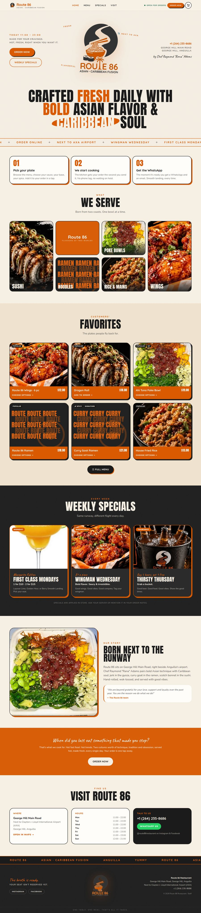
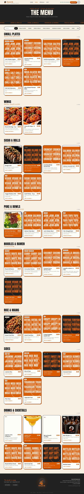
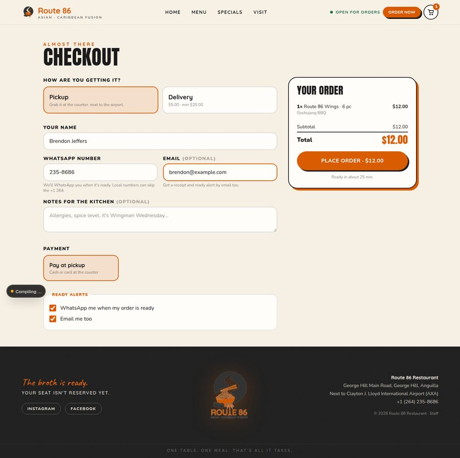
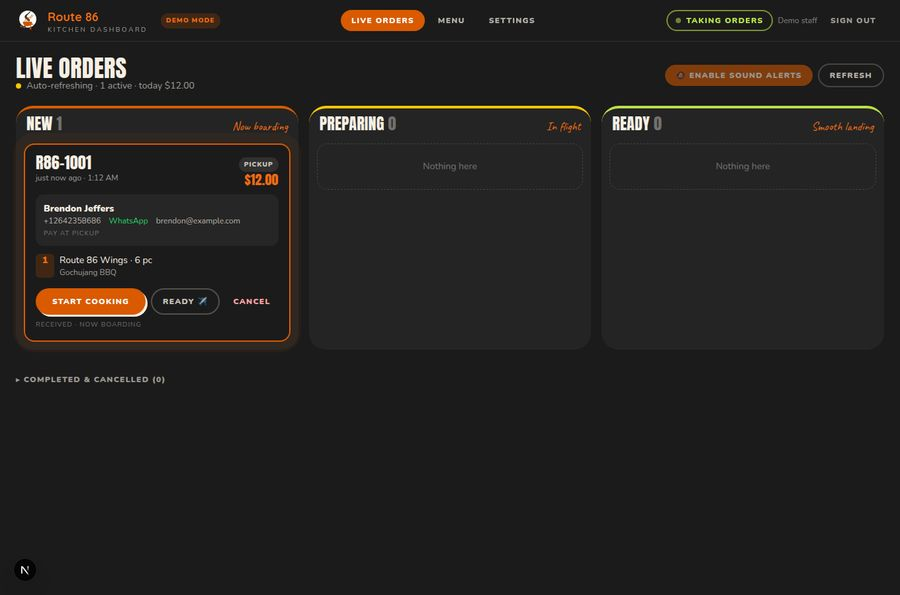
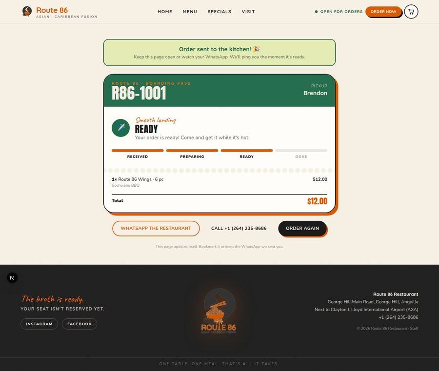

# Route 86 · online ordering platform

Live at **https://www.fetelabstest2.site** (Vercel) · database on Supabase.

Website + ordering web app for **Route 86 Restaurant**, Asian · Caribbean Fusion, George Hill Main Road (next to AXA Airport), Anguilla.

- Customers browse the menu, build an order (pickup or delivery) and get a live **boarding-pass style tracking page**.
- The kitchen gets every order **in real time** on a live board with sound + browser alerts (plus optional WhatsApp/email pings to the store).
- **One click** on the board ("Ready ✈️") automatically messages the customer on **WhatsApp and email**.
- Staff can 86 items, change prices, feature dishes, pause ordering, and edit hours/fees from their phone.

## Stack

| Layer | Choice |
| --- | --- |
| App | Next.js 16 (App Router, React 19, TypeScript), Tailwind CSS v4 |
| Data + realtime + auth | Supabase (Postgres, RLS, SECURITY DEFINER functions, Realtime, Auth). No service-role key anywhere. |
| WhatsApp | Twilio WhatsApp **or** Meta WhatsApp Cloud API (switch with one env var) |
| Email | Resend |
| Hosting | Vercel (or any Node host) |

The app also runs in **demo mode** with zero configuration: no database, an in-memory order store, and a passcode-protected dashboard. That is what you get with `pnpm dev` and an empty `.env`.

## Quick start

```bash
pnpm install
cp .env.example .env        # optional; blank = demo mode
pnpm dev                    # http://localhost:3000  ·  dashboard: /admin (passcode: route86)
```

Verify: `pnpm lint && pnpm typecheck && pnpm test && pnpm build`.

## Going live

### 1. Supabase (already provisioned for this repo)

The production project lives at `https://xcknmpgiondscrgysyfb.supabase.co` and `.env.production` carries its public URL + anon key, so a fresh deployment needs **no database env vars**. Everything privileged runs inside `SECURITY DEFINER` functions (`create_order`, `get_public_order`, `log_notification`) and row-level security; staff sign in with Supabase Auth and must exist in the `staff` table.

To set up a new project from scratch: run `supabase/migrations/0001_init.sql` then `0002_rpc_and_realtime.sql` in the SQL editor, create a staff user under **Authentication → Users**, insert their email into `staff`, then seed the menu through their login:

```bash
STAFF_EMAIL=owner@example.com STAFF_PASSWORD=... pnpm seed:remote
```

Re-running `pnpm seed:remote` re-syncs names, prices and descriptions from `src/lib/seed-menu.ts` while keeping live 86 / featured toggles.

### 2. WhatsApp

Pick one provider and set `WHATSAPP_PROVIDER`:

- **Twilio** (`twilio`): `TWILIO_ACCOUNT_SID`, `TWILIO_AUTH_TOKEN`, `TWILIO_WHATSAPP_FROM`. Start with the sandbox, then register the restaurant number as a WhatsApp sender. Business-initiated messages outside a 24-hour customer session must use approved templates: create them in Twilio Content Builder with one `{{1}}` variable and set `TWILIO_CONTENT_SID_ORDER_RECEIVED`, `..._ORDER_READY`, `..._ORDER_OUT_FOR_DELIVERY`, `..._ORDER_CANCELLED`, `..._STORE_NEW_ORDER`.
- **Meta Cloud API** (`meta`): `META_WA_PHONE_NUMBER_ID`, `META_WA_ACCESS_TOKEN`, optional `META_WA_TEMPLATE_*` names.

Message copy lives in `src/lib/notify/templates.ts`.

### 3. Email

Resend: `RESEND_API_KEY` and `EMAIL_FROM` (verify the sending domain in Resend first).

### 4. Deploy

[](https://vercel.com/new/clone?repository-url=https://github.com/JUPUni/route86&project-name=route86)

Import the repo on Vercel (the button above does it). It builds and runs against the live database with no extra configuration. Then add the WhatsApp/email env vars from `.env.example` and set `NEXT_PUBLIC_SITE_URL` to the production URL so the links inside customer messages point at the right place. Staff can "Add to Home Screen" `/admin` on a tablet or phone; the app ships a web manifest.

## How an order flows

1. `POST /api/orders` validates the cart and phone (Anguilla local numbers get `+1 264`), then calls the `create_order` Postgres function, which re-prices every line from `menu_items` (clients never set prices) and inserts the order.
2. In the background it sends the customer an "order received" WhatsApp + email, pings the store (WhatsApp/email if configured), and broadcasts to Realtime.
3. A database trigger broadcasts every insert/update to `store:orders` and `order:{id}` over Supabase Realtime. The dashboard (`/admin`) listens to that plus `postgres_changes` on `orders`; it chimes, shows a browser notification and flashes the tab title. It also polls as a fallback.
4. Staff press **Ready ✈️**: `PATCH /api/orders/[id]/status` updates the row through their own RLS-checked session and sends the "smooth landing" WhatsApp + email; the trigger flips the customer's page instantly.
5. Every notification attempt is written to the `notifications` table (sent / failed / skipped + provider id) so nothing is silent.

## Project map

```
src/app/(site)          customer site: home, menu, checkout, order/[id]
src/app/admin           staff dashboard: live orders, menu, settings (+ login)
src/app/api             orders, status, admin endpoints, health
src/components          site / menu / cart / order / admin UI
src/lib/brand.ts        brand facts, specials, status copy
src/lib/seed-menu.ts    starter menu (edit here, then `pnpm seed:sql`)
src/lib/orders.ts       pricing, validation, status machine, realtime broadcast
src/lib/notify          WhatsApp + email providers and templates
supabase/               schema + RLS + seed
```

## Things to confirm with the restaurant

- Menu items and prices in `src/lib/seed-menu.ts` are a starter set built from the restaurant's public posts (poke bowls, sushi, fried rice, ramen, wings, margaritas, beer buckets). Replace with the real menu.
- Opening hours, delivery fee/minimum, tax (Anguilla GST) and prep time are placeholders editable in **Admin → Settings**.
- The store WhatsApp number defaults to the published phone line (+1 264 235 8686).

## Screenshots

| Home | Menu | Checkout |
| --- | --- | --- |
|  |  |  |

| Live order board (staff) | Customer tracking page |
| --- | --- |
|  |  |
